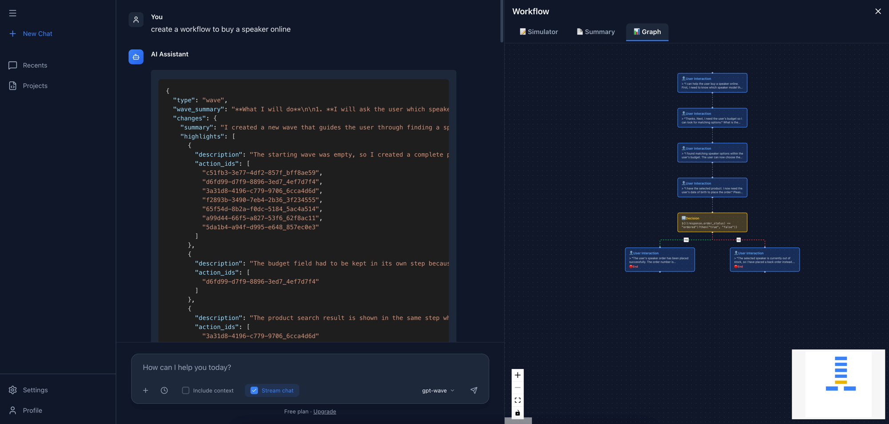

# Agent Workflow UI

A React-based user interface for interacting with AI agent APIs, featuring chat functionality and workflow visualization.



## Features

- 💬 **Multi-Model Chat** - Support for multiple AI models (GPT-4, Claude, Gemini, gpt-wave)
- 🔄 **Workflow Visualization** - Interactive flowchart visualization for gpt-wave workflows
- 🎨 **Syntax Highlighting** - Automatic JSON detection and syntax highlighting
- 📊 **Interactive Graph** - Zoom, pan, and explore workflow diagrams with ReactFlow
- 🎯 **Real-time Updates** - Live chat interface with loading states

## Prerequisites

- Node.js (v16 or higher)
- npm or yarn
- Backend API server running on `http://localhost:8080`

## Installation

1. **Clone the repository**
   ```bash
   git clone https://github.com/SparkleProject/agent-workflow-ui.git
   cd agent-workflow-ui
   ```

2. **Install dependencies**
   ```bash
   npm install
   ```

## Running the Application

### Development Mode

Start the development server with hot reload:

```bash
npm run dev
```

The application will be available at `http://localhost:5174`

### Production Build

Build the application for production:

```bash
npm run build
```

Preview the production build:

```bash
npm run preview
```

## Backend Configuration

This UI expects a backend API server to be running at `http://localhost:8080` with the following endpoints:

- `POST /api/azure/chat` - Send chat messages
- `GET /api/azure/models` - Get list of available models

Make sure your backend server is running before using the UI.

## Project Structure

```
src/
├── components/          # React components
│   ├── ChatInput.jsx   # Message input component
│   ├── MessageList.jsx # Chat message display
│   ├── WorkflowGraph.jsx # Workflow visualization
│   ├── Sidebar.jsx     # Navigation sidebar
│   └── WelcomeScreen.jsx # Initial welcome screen
├── services/           # API services
│   └── agentApi.js    # API client functions
├── lib/               # Utilities
│   └── utils.js       # Helper functions
├── App.jsx            # Main application component
└── index.css          # Global styles
```

## Technology Stack

- **React** - UI framework
- **Vite** - Build tool and dev server
- **ReactFlow** - Interactive workflow diagrams
- **React Markdown** - Markdown rendering with GFM support
- **React Syntax Highlighter** - Code syntax highlighting
- **Tailwind CSS** - Utility-first CSS framework
- **Lucide React** - Icon library

## Available Scripts

- `npm run dev` - Start development server
- `npm run build` - Build for production
- `npm run preview` - Preview production build
- `npm run lint` - Run ESLint

## Features in Detail

### Chat Interface
Send messages to different AI models and receive formatted responses with syntax highlighting for code and JSON.

### Workflow Visualization
When using the gpt-wave model, workflows are automatically visualized as interactive flowcharts with:
- Color-coded nodes (user interactions, API calls, decisions)
- Animated edges showing flow direction
- "Yes"/"No" labels for decision branches
- Zoom, pan, and minimap controls

### JSON Auto-Detection
JSON responses are automatically detected and formatted with syntax highlighting, even when returned as plain text.

## Contributing

Contributions are welcome! Please feel free to submit a Pull Request.

## License

[Your License Here]
